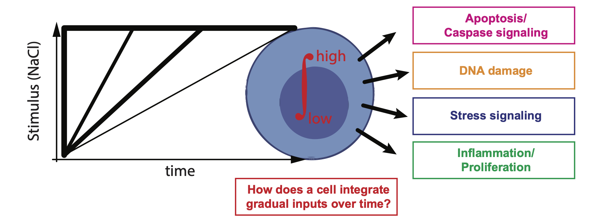

Hello, I am Alexander Thiemicke and I am currently a PhD Candidate at [Vanderbilt University](https://www.vanderbilt.edu/) in the [Chemical and Physical Biology PhD Program](https://medschool.vanderbilt.edu/cpb/person/alexander-thiemicke/). I am interested in understanding how cells respond to stress in different temporally changing environments.

 

### How does the environment control cell fate?

In particular, I am interested in understanding how cells sense, integrate and respond to environmental stimulation. In the context of PhD work in the lab of my PhD advisor [Gregor Neuert](https://scholar.google.com/citations?user=k2lm0AIAAAAJ), I study the effect of gradual increases of extracellular stress on cells. I focus on the effect of increasing hypertonicity on cells as recent findings have shown that NaCl induced hypertonicity can play a role in many different tissues and in several diseases.

 

In the manuscript[[1]](https://athiemicke.com/publications.html) I am preparing, I found that gradual increase in hypertonicity sends a different signal to the cell than a step-like sudden increase in hypertonicity.